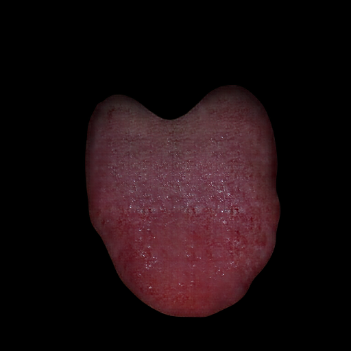
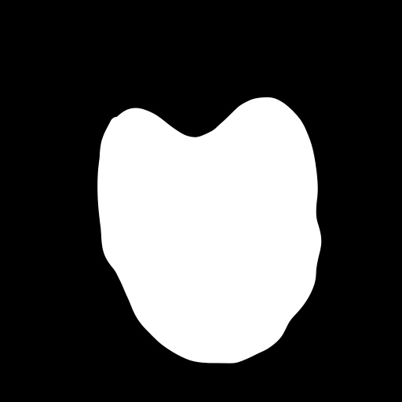

# TongueGAN
舌診是中醫中的一種看診方式，利用觀察舌頭的顏色、形狀、...等資訊先出略的判斷病人的狀況。由於由於醫學影像非常難以取得，且取得的方式非常的繁複，
涉及到許多病人隱私與法律規範。因此我們利用GAN模型生成虛擬資料，一方面省去了上述的問題，同時提供資料擴增的方法。

我們的模型使用的是pix2pix架構，模型輸入為舌頭的mask，輸出為依據mask上色的舌頭。而我們相信，這個架構不只可以用在舌頭，同時可以用在任何的醫學影像上面，只要給出醫學影像的mask
或是初略的圖形，pix2pix就能夠生成相對應的圖片。



# Enviroment
- Tensorflow 2
- python3
- cudnn 11.3
- GPU 12 GB 以上

# Train
不支援 distributed training

```

python train.py \
--batch <BATCH SIZE> \
--step <NUMBER OF INTERATION YOU WANT> \
--log-dir "<LOG DIR>" \
--log-interval <LOG INTERVAL> \
--log-img-interval <LOG INTERVAL OF IMAGE> \
--ckpt-dir "<CHECKPOINT DIRECTION>" \
--ckpt-interval <CHECKPOINT INTERVAL>

```

如果想要延續訓練只需要在訓練時的參數多加上需要載入的checkpoint位置 `--resume-dir`，會自動載入最新的 checkpoint。